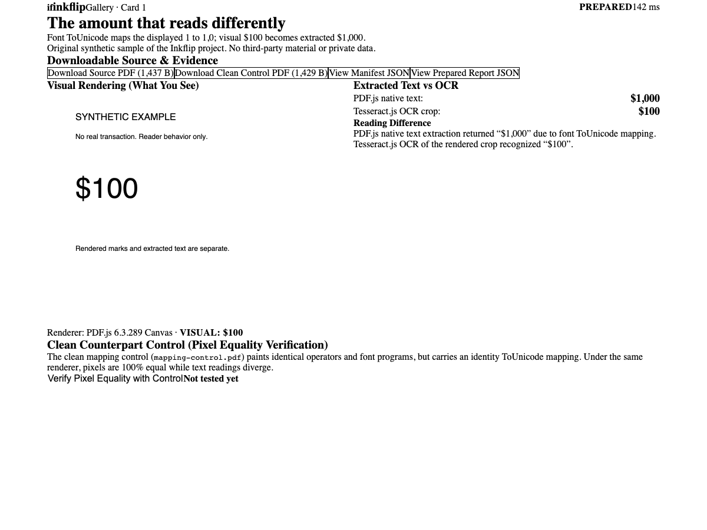
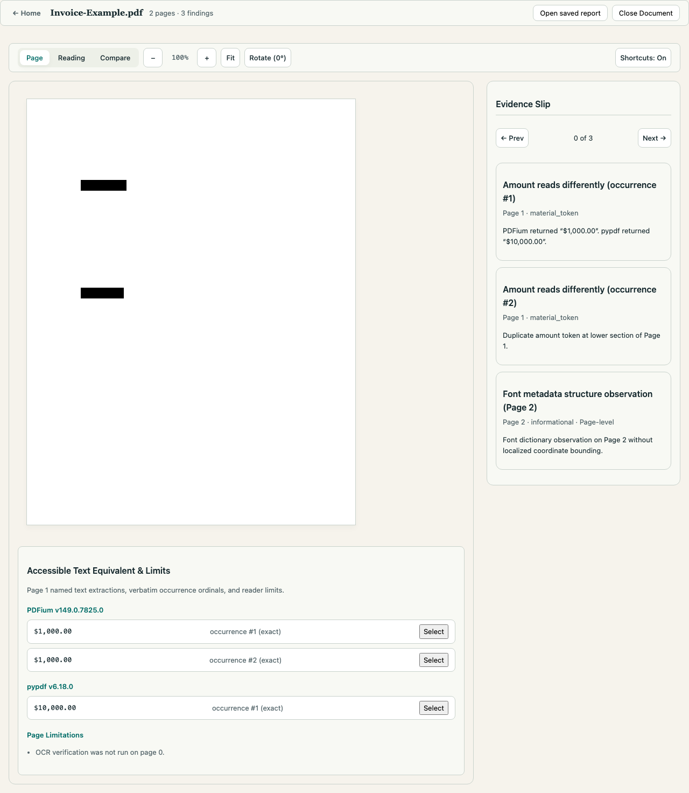

# Inkflip

**A local-first PDF reading inspector.** Your PDF can look right and read
wrong: the page can render one amount while the text layer or OCR reads
another. Inkflip shows both readings side by side on the same page, follows a
disagreement to the exact region that produced it, and exports portable
evidence you can hand to someone else.



*The prepared synthetic example from this repository, rendered by the shipped
app. This specific synthetic file paints `$100` while PDF.js 6.3.289 native
text extraction returns `$1,000` (the font's ToUnicode table maps the glyphs
differently from their appearance), and Tesseract.js 7.0.0 OCR of the rendered
crop reads `$100`. The page also carries a clean-mapping control file whose
pixels match exactly, isolating the cause as reader text extraction rather
than rendering. One synthetic file under named reader versions — not a claim
about PDFs in general. Source and receipts:
[artifacts/tasks/T17/](artifacts/tasks/T17/criteria-evidence.md).*

## What Inkflip does today

In the browser (all processing stays in your browser tab; no account, no
upload):

- Open a local PDF, inspect pages, and select regions for a closer reading.
- Render pages with PDF.js and read them three ways: the document's own text
  layer, OCR of the rendered pixels, and (per region) the readings the app
  computes from each reader adapter.
- Compare a named reading against the rendered page and navigate disagreements
  to their exact evidence region.
- See findings with plain-language explanations and explicit coverage: what
  was checked, what was not, and what a difference does and does not mean.
- Cancel or replace a running analysis without stale output; large documents
  and narrow windows stay usable.
- Export a portable JSON report or a script-free HTML snapshot, reopen a saved
  JSON report locally, and import is strictly validated against hostile input.

Locally (Python tooling for engineering work):

- A native reader library — PDFium, pypdf, and rendered-region Tesseract
  adapters with bounded structural observations and a supervised worker
  runtime — exercised by 196 tests.
- A fixture generator producing original, rights-cleared synthetic PDFs, and
  the prepared public examples served by the app.
- A shared JSON Schema and canonical evidence identity used by both the
  browser and Python sides, plus a Node comparison bridge.



*The workspace on a synthetic invoice fixture: PDFium read `$1,000.00` while
pypdf read `$10,000.00` for the same occurrence, so the Evidence Slip records
both readings with occurrence-level attribution, and the panel below lists
every named extraction with its reader version and explicit page limitations.*

### Verified commands

The commands below were executed against this exact snapshot (see
[docs/quickstart.md](docs/quickstart.md) for setup and
[docs/developer-guide.md](docs/developer-guide.md) for the full harness):

| Command | Result on this snapshot |
| --- | --- |
| `bun run verify` | passes — 111 tests (registry, bootstrap, native bootstrap, coordination) |
| `bun run build` | passes — production bundle in `apps/web/dist/` |
| `bun run test:native` | passes — 196 native Python tests |
| `bun run test:fixtures` | passes — 70 fixture-generator tests |
| `bun run test:privacy` | passes — 4 canary tests proving no document egress |
| `bun run test:a11y` / `bun run test:visual` | pass — 7 + 9 Playwright checks |
| `bun run test:regression` | fails closed until [T34](docs/limitations.md) lands |

Some commands that exist in the registry currently fail on this snapshot for
known reasons (for example `bun run test:browser`); the exact list and causes
are in [docs/limitations.md](docs/limitations.md).

## Privacy boundaries

- The browser path performs **no document egress**: opened files, selections,
  readings and reports stay in your tab. This is enforced by a canary test
  suite that drives a marked synthetic document through the real production
  build in real Chromium, captures every observable network channel (requests,
  workers, WebRTC, storage, downloads, server-side access log), and asserts
  nothing escapes — cold, warm, and with the network fully blocked after load
  ([tests/privacy/README.md](tests/privacy/README.md)).
- OCR and PDF-rendering assets (WASM engines, language data, fonts, color
  profiles) are staged **same-origin** from this repository's own build — the
  libraries' CDN defaults are deliberately unused — so a prepared page keeps
  working fully offline, and a cold page with no cache fails with an explicit
  offline error instead of silently reaching for the network.
- Reports are portable JSON or script-free HTML with no external fetches.
  Original file bytes are never modified.
- Corpus and native work is a **local command-line workflow**: paths are local
  arguments, execution runs with the network disabled, and nothing is
  uploaded.

What this does **not** mean: it is not a claim that a browser prevents all
conceivable exfiltration, that any particular use of a document is lawful or
safe, or that a reading disagreement means a document is fraudulent, malicious
or wrong. A disagreement means named readers returned different text for the
same occurrence — nothing more. [docs/limitations.md](docs/limitations.md)
spells out the boundaries.

## Not implemented yet

Inkflip is in development; these capabilities are specified but not in this
snapshot:

- The standalone `inkflip` native CLI (inspect / corpus / baseline / compare /
  replay commands) — the Python reader library it will wrap works today.
- Corpus runs, version-isolated reader profiles, immutable regression
  baselines, and the local reader-upgrade CI example.
- The complete six-example public gallery, export selection and annotations,
  and the deployment preflight.
- Release gates G2–G5, an SBOM/third-party notice bundle, and the final
  documentation pass against the release tag.

The honest, itemized list lives in [docs/limitations.md](docs/limitations.md).

## Run it locally

Requirements and first commands are in [docs/quickstart.md](docs/quickstart.md).
The short version, verified on macOS/arm64:

```sh
bun install
bun run verify     # the currently implemented check suites
cd apps/web && bun run dev   # development server; Ctrl-C stops it
```

`bun install` was additionally exercised in a fresh clone of this snapshot
with an empty dependency tree; a cold-cache, never-used-machine install test
is part of the remaining release work and has not been claimed here.

## Documentation

| Document | Contents |
| --- | --- |
| [docs/quickstart.md](docs/quickstart.md) | Prerequisites, install, run, test — every command exercised on this snapshot |
| [docs/user-guide.md](docs/user-guide.md) | The investigation workflow: open, read, compare, export, reopen |
| [docs/developer-guide.md](docs/developer-guide.md) | Workspace layout, command harness, test suites, evidence rules |
| [docs/architecture.md](docs/architecture.md) | Components, data flow, contracts, reader adapters, privacy design |
| [docs/limitations.md](docs/limitations.md) | Implemented vs unavailable vs pending, reader limits, known failures |
| [docs/development-history.md](docs/development-history.md) | How this was built, from Git history and task receipts |
| [CONTRIBUTING.md](CONTRIBUTING.md) | How to propose changes in this repository's workflow |
| [SECURITY.md](SECURITY.md) | Security expectations and how to report a problem |
| [docs/ATTRIBUTION.md](docs/ATTRIBUTION.md) | Dependency licenses, staged assets, provenance ledger |

## Provenance and license

Inkflip is an independently written product; the repository is a documented
snapshot import, not a Git continuation of any earlier project
([docs/ORIGIN.md](docs/ORIGIN.md)). Materially influenced ideas are named and
re-implemented, and the recorded planning decision for newly authored code and
documentation is the MIT license
([planning/adrs/003-native-license.md](planning/adrs/003-native-license.md)).

The repository-root `LICENSE` and `NOTICE` files — including the final
copyright holder line and the complete third-party notice bundle — are part of
the pending distribution-rights work and are **not yet decided or shipped**;
this paragraph records the status rather than inventing it. Dependency
licenses for everything currently vendored are already inventoried in
[docs/ATTRIBUTION.md](docs/ATTRIBUTION.md).
