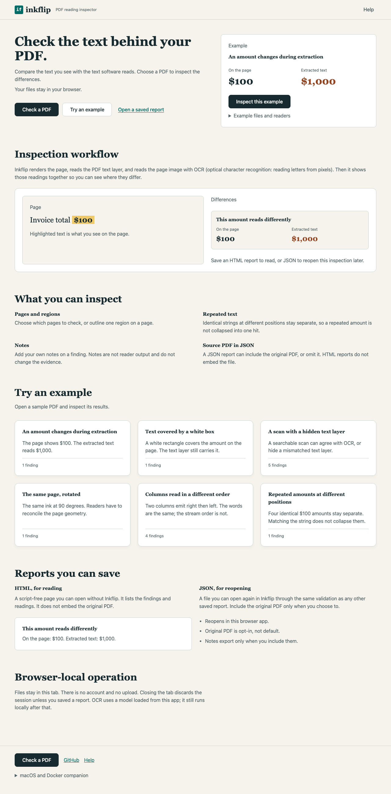
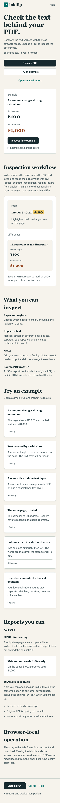
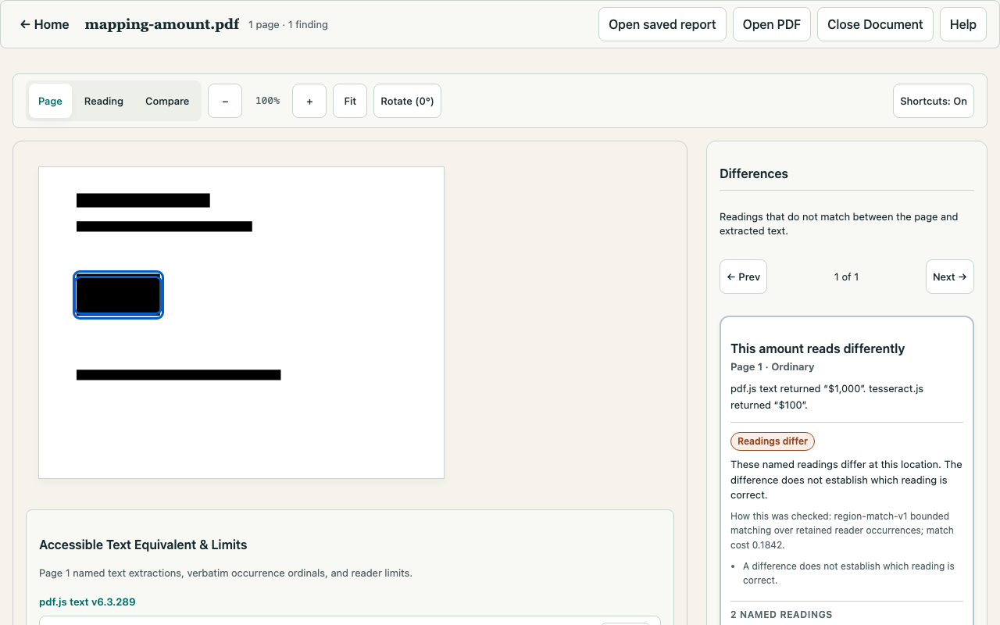

# Inkflip

**[Live demo](https://inkflip-rose.vercel.app)**

Check the text behind your PDF.

Inkflip is a local-first PDF reading inspector. It compares the text you
see with the text software reads, so a `$100` that extracts as `$1,000`
is visible before it reaches a spreadsheet or a model. Analysts, engineers,
and anyone who has to trust extracted PDF text can open a file in the
browser, inspect a disagreement, and save a portable report. Nothing is
uploaded.







## Try it

1. Open the [live demo](https://inkflip-rose.vercel.app) and choose **Try an example**, or **Check a PDF** with a file on your computer.
2. Select a difference and look at the named readings on the page.
3. Save a JSON report to reopen in Inkflip, or a script-free HTML report to read without the app.

A highlighted difference does not prove which reading is correct, and the
absence of differences is not a certification. The HTML download does not
embed the original PDF.

## What is implemented

- Browser inspector: open a local PDF or a saved report, compare named
  readers, follow findings to the page, add notes, export JSON/HTML, reopen
  JSON through the same validation boundary.
- Production static deploy of that browser app (GitHub Actions → Vercel).
- Native CLI in this repository (`inkflip`: inspect, compare, report,
  replay, corpus, baselines) with version-isolated reader profiles. See
  [docs/CLI.md](docs/CLI.md) and [docs/quickstart.md](docs/quickstart.md)
  for macOS and Docker usage.
- Shared report contracts and synthetic public fixtures.

## Limits

- Files are processed in the browser tab. There is no account or document
  upload service.
- OCR quality depends on the scan; incomplete checks stay visible.
- Automated accessibility flows exist; a manual assistive-technology review
  is still open.
- A linux/amd64 native image was built and exercised locally. It is not a
  signed, bit-identical, cross-platform public release.

Dated snapshot detail lives in [docs/limitations.md](docs/limitations.md).

## Run locally

Use Bun **1.4.0**, Node **22.23.2**, and uv **0.12.13 or later**. The native
project pins Python **3.13.15**. The complete toolchain is recorded in
[config/test-toolchain.json](config/test-toolchain.json).

```sh
bun install --frozen-lockfile
uv sync --frozen --project native
cd apps/web
bun run dev
```

Open the localhost address printed by Vite. Dependency installation may use
the network; document processing uses local readers and bundled assets.

## Build and check

From the repository root:

```sh
bun run verify
bun run build
bun run test:native
bun run test:fixtures
```

`bun run test:native` also needs the PDF.js Node profile's own locked dependency,
which is not part of the workspace install:

```sh
cd packages/readers-pdfjs/node && bun install --frozen-lockfile
```

For browser checks, install the test browser explicitly:

```sh
bun x playwright install chromium
bun run test:browser
bun run test:privacy
bun run test:a11y
bun run test:visual
```

The production bundle is written to `apps/web/dist/`. CI checks repository
and command integrity; a green CI run alone does not certify a signed
native release. See [validation](docs/ACCEPTANCE.md) for the release
evidence requirements.

## Explore the code

| Directory | Contents |
| --- | --- |
| `apps/web/` | React inspector and static browser assets |
| `packages/` | Readers, comparison, geometry, runtime and report contracts |
| `native/` | Python readers and supervised processing |
| `fixtures/` | Public synthetic fixtures and development cases |
| `tests/` | Browser, privacy, contract and integration checks |
| `planning/` | Preserved product specification and invariants |

## How this was built

Work started on 11 September 2026 and continued through 14 September 2026:
a weekend of core implementation, then further polish of the inspector,
reports, and publication path. [Devin](https://devin.ai) SWE-2 led
implementation and integration under the owner's direction and review.
Other coding agents handled parallel slices (UI, checks, documentation).
This is not a claim that one model wrote every line, and it is not a
bounded 48-hour contest log. Commit history, licenses, and
[origin](docs/ORIGIN.md) records are the source of truth.

## Documentation

| Document | Contents |
| --- | --- |
| [docs/quickstart.md](docs/quickstart.md) | Prerequisites, install, run, build and check |
| [docs/user-guide.md](docs/user-guide.md) | Open, read, compare, annotate, export, reopen |
| [docs/architecture.md](docs/architecture.md) | Components, data flow, contracts, privacy design |
| [docs/limitations.md](docs/limitations.md) | Implemented vs incomplete vs not built |
| [docs/developer-guide.md](docs/developer-guide.md) | Workspace layout, command harness, suites |
| [docs/development-history.md](docs/development-history.md) | Build history from Git and validation records |
| [docs/distribution/README.md](docs/distribution/README.md) | What ships, license/notice evidence |
| [docs/release-and-rollback.md](docs/release-and-rollback.md) | Release path and rollback |
| [SECURITY.md](SECURITY.md) | Security expectations and reporting |

## License

MIT. Copyright (c) 2026 zubair. Third-party notices and the snapshot-import
record are in [ATTRIBUTION](docs/ATTRIBUTION.md) and [ORIGIN](docs/ORIGIN.md).
