# Issue dependency graph

Authoritative records: [tasks.json](tasks.json). All implementation tasks remain planned. Dependencies require accepted merged-branch evidence. Optional technique experiments may close with a reviewed rejection; required capabilities cannot.

```mermaid
flowchart TD
  T01["T01 Bootstrap the separate monorepo and honest origin"]
  T02["T02 Freeze actual dependency locks, model assets and build provenance"]
  T01 --> T02
  T03["T03 Implement schema, strict validation, canonical identity and generated types"]
  T01 --> T03
  T04["T04 Implement canonical geometry and transform conformance"]
  T03 --> T04
  T05["T05 Create original fixture foundation and rights manifest"]
  T01 --> T05
  T06["T06 Translate selected composition into tokens and visual foundations"]
  T01 --> T06
  T07["T07 Build accessible reusable controls and navigation"]
  T06 --> T07
  T03 --> T07
  T08["T08 Implement local file validation and page/region selection"]
  T02 --> T08
  T03 --> T08
  T07 --> T08
  T09["T09 Implement PDF.js rendering/text reader adapter"]
  T02 --> T09
  T03 --> T09
  T04 --> T09
  T05 --> T09
  T10["T10 Implement browser selected-page/crop OCR"]
  T02 --> T10
  T03 --> T10
  T04 --> T10
  T05 --> T10
  T11["T11 Implement run lifecycle, backpressure and cancellation"]
  T03 --> T11
  T04 --> T11
  T12["T12 Implement raw normalization and conservative alignment"]
  T03 --> T12
  T04 --> T12
  T05 --> T12
  T13["T13 Integrate page/text/compare viewer and exact evidence navigation"]
  T07 --> T13
  T08 --> T13
  T09 --> T13
  T11 --> T13
  T12 --> T13
  T14["T14 Implement findings, coverage and plain explanations"]
  T03 --> T14
  T07 --> T14
  T11 --> T14
  T12 --> T14
  T15["T15 Prove initial own-file no-egress behavior"]
  T08 --> T15
  T09 --> T15
  T10 --> T15
  T11 --> T15
  T16 --> T15
  T22 --> T15
  T16["T16 Implement portable JSON and escaped HTML export foundation"]
  T03 --> T16
  T04 --> T16
  T07 --> T16
  T17["T17 Earn the browser amount demo and prepared manifest"]
  T05 --> T17
  T09 --> T17
  T10 --> T17
  T12 --> T17
  T14 --> T17
  T16 --> T17
  T18["T18 Pass the first integrated own-file evidence gate"]
  T13 --> T18
  T14 --> T18
  T15 --> T18
  T17 --> T18
  T22 --> T18
  T19["T19 Complete large-document and narrow-device interaction"]
  T18 --> T19
  T20["T20 Finish repeated, ambiguous, order and unmatched evidence UX"]
  T18 --> T20
  T21["T21 Complete all six original public examples and controls"]
  T18 --> T21
  T05 --> T21
  T22["T22 Implement strict local JSON import and reopen flow"]
  T03 --> T22
  T07 --> T22
  T11 --> T22
  T16 --> T22
  T24 --> T22
  T23["T23 Finish export selection, annotations and privacy preview"]
  T18 --> T23
  T20 --> T23
  T24["T24 Harden malicious report, text and image boundaries"]
  T02 --> T24
  T03 --> T24
  T25["T25 Implement explicit offline static/model cache lifecycle"]
  T18 --> T25
  T02 --> T25
  T26["T26 Implement native PDFium and pypdf reader adapters"]
  T02 --> T26
  T03 --> T26
  T04 --> T26
  T05 --> T26
  T27["T27 Implement native rendered-region Tesseract reader"]
  T02 --> T27
  T03 --> T27
  T04 --> T27
  T26 --> T27
  T28["T28 Implement bounded native structural observations"]
  T26 --> T28
  T05 --> T28
  T29["T29 Implement native parent supervision and atomic partial results"]
  T03 --> T29
  T26 --> T29
  T30["T30 Implement native inspect/report/replay command contracts"]
  T27 --> T30
  T28 --> T30
  T29 --> T30
  T16 --> T30
  T22 --> T30
  T31["T31 Implement shared Node comparison bridge"]
  T03 --> T31
  T12 --> T31
  T16 --> T31
  T32["T32 Implement corpus run, journal and validated resume"]
  T30 --> T32
  T33["T33 Implement explicit version-isolated reader profiles"]
  T02 --> T33
  T30 --> T33
  T34["T34 Implement stored-run comparison, rules and immutable baselines"]
  T31 --> T34
  T32 --> T34
  T33 --> T34
  T35["T35 Deliver the runnable local reader-upgrade CI example"]
  T34 --> T35
  T33 --> T35
  T36["T36 Build independent evaluation protocol and held-out corpus"]
  T05 --> T36
  T03 --> T36
  T37["T37 Complete accessibility and manual assistive-technology review"]
  T19 --> T37
  T20 --> T37
  T21 --> T37
  T22 --> T37
  T23 --> T37
  T38["T38 Polish complete visual states on real supported layouts"]
  T19 --> T38
  T20 --> T38
  T21 --> T38
  T23 --> T38
  T25 --> T38
  T39["T39 Measure and enforce runtime/device performance budgets"]
  T19 --> T39
  T25 --> T39
  T30 --> T39
  T40["T40 Verify native containment and failure recovery"]
  T29 --> T40
  T30 --> T40
  T32 --> T40
  T41["T41 Run paint-order and ink-counterexample experiment"]
  T18 --> T41
  T28 --> T41
  T36 --> T41
  T42["T42 Run targeted OCR escalation experiment"]
  T18 --> T42
  T36 --> T42
  T43["T43 Evaluate secondary browser reader, decide explicitly"]
  T18 --> T43
  T36 --> T43
  T44["T44 Evaluate one native RapidOCR complement"]
  T27 --> T44
  T36 --> T44
  T45["T45 Evaluate original-preserving raster geometry only"]
  T26 --> T45
  T27 --> T45
  T36 --> T45
  T46["T46 Verify browser/native and cross-environment parity"]
  T18 --> T46
  T30 --> T46
  T34 --> T46
  T47["T47 Close distribution rights, SBOM and vulnerability gate"]
  T02 --> T47
  T21 --> T47
  T25 --> T47
  T30 --> T47
  T43 --> T47
  T44 --> T47
  T48["T48 Validate static build, CSP, caching and deployment preflight"]
  T02 --> T48
  T25 --> T48
  T21 --> T48
  T49["T49 Finish user/developer docs and honest limitations"]
  T21 --> T49
  T23 --> T49
  T25 --> T49
  T35 --> T49
  T28 --> T49
  T50["T50 Prepare evidence-linked launch and portfolio material"]
  T21 --> T50
  T38 --> T50
  T35 --> T50
  T51["T51 Close complete public investigation capability gate"]
  T19 --> T51
  T20 --> T51
  T21 --> T51
  T22 --> T51
  T23 --> T51
  T25 --> T51
  T52["T52 Close native and regression capability gate"]
  T28 --> T52
  T30 --> T52
  T31 --> T52
  T32 --> T52
  T33 --> T52
  T34 --> T52
  T35 --> T52
  T53["T53 Close quality, privacy, performance and rights gate"]
  T36 --> T53
  T37 --> T53
  T38 --> T53
  T39 --> T53
  T40 --> T53
  T41 --> T53
  T42 --> T53
  T43 --> T53
  T44 --> T53
  T45 --> T53
  T46 --> T53
  T47 --> T53
  T54["T54 Owner-authorized static deployment, rollback and final release"]
  T55 --> T54
  T55["T55 Perform final adversarial merged-branch review"]
  T51 --> T55
  T52 --> T55
  T53 --> T55
  T48 --> T55
  T49 --> T55
  T50 --> T55
```

| Task | Owner role | Dependencies | Gate |
|---|---|---|---|
| [T01](workers/T01.md) Bootstrap the separate monorepo and honest origin | integrator | none | G1 |
| [T02](workers/T02.md) Freeze actual dependency locks, model assets and build provenance | supply-chain-owner | T01 | G1 |
| [T03](workers/T03.md) Implement schema, strict validation, canonical identity and generated types | contract-owner | T01 | G1 |
| [T04](workers/T04.md) Implement canonical geometry and transform conformance | geometry-owner | T03 | G1 |
| [T05](workers/T05.md) Create original fixture foundation and rights manifest | fixture-author | T01 | G1 |
| [T06](workers/T06.md) Translate selected composition into tokens and visual foundations | product-designer | T01 | G1 |
| [T07](workers/T07.md) Build accessible reusable controls and navigation | frontend-accessibility | T06, T03 | G1 |
| [T08](workers/T08.md) Implement local file validation and page/region selection | browser-input | T02, T03, T07 | G1 |
| [T09](workers/T09.md) Implement PDF.js rendering/text reader adapter | browser-reader | T02, T03, T04, T05 | G1 |
| [T10](workers/T10.md) Implement browser selected-page/crop OCR | browser-ocr | T02, T03, T04, T05 | G1 |
| [T11](workers/T11.md) Implement run lifecycle, backpressure and cancellation | browser-runtime | T03, T04 | G1 |
| [T12](workers/T12.md) Implement raw normalization and conservative alignment | comparison-engine | T03, T04, T05 | G1 |
| [T13](workers/T13.md) Integrate page/text/compare viewer and exact evidence navigation | frontend-viewer | T07, T08, T09, T11, T12 | G1 |
| [T14](workers/T14.md) Implement findings, coverage and plain explanations | frontend-evidence | T03, T07, T11, T12 | G1 |
| [T15](workers/T15.md) Prove initial own-file no-egress behavior | privacy-reviewer | T08, T09, T10, T11, T16, T22 | G1 |
| [T16](workers/T16.md) Implement portable JSON and escaped HTML export foundation | report-engine | T03, T04, T07 | G1 |
| [T17](workers/T17.md) Earn the browser amount demo and prepared manifest | demo-engineer | T05, T09, T10, T12, T14, T16 | G1 |
| [T18](workers/T18.md) Pass the first integrated own-file evidence gate | integration-reviewer | T13, T14, T15, T17, T22 | G1 |
| [T19](workers/T19.md) Complete large-document and narrow-device interaction | frontend-runtime | T18 | G2 |
| [T20](workers/T20.md) Finish repeated, ambiguous, order and unmatched evidence UX | frontend-comparison | T18 | G2 |
| [T21](workers/T21.md) Complete all six original public examples and controls | fixture-designer | T18, T05 | G2 |
| [T22](workers/T22.md) Implement strict local JSON import and reopen flow | report-import | T03, T07, T11, T16, T24 | G1 |
| [T23](workers/T23.md) Finish export selection, annotations and privacy preview | frontend-reports | T18, T20 | G2 |
| [T24](workers/T24.md) Harden malicious report, text and image boundaries | security-engineer | T02, T03 | G1 |
| [T25](workers/T25.md) Implement explicit offline static/model cache lifecycle | browser-storage | T18, T02 | G2 |
| [T26](workers/T26.md) Implement native PDFium and pypdf reader adapters | native-readers | T02, T03, T04, T05 | G3 |
| [T27](workers/T27.md) Implement native rendered-region Tesseract reader | native-ocr | T02, T03, T04, T26 | G3 |
| [T28](workers/T28.md) Implement bounded native structural observations | native-structure | T26, T05 | G3 |
| [T29](workers/T29.md) Implement native parent supervision and atomic partial results | native-runtime | T03, T26 | G3 |
| [T30](workers/T30.md) Implement native inspect/report/replay command contracts | cli-engineer | T27, T28, T29, T16, T22 | G3 |
| [T31](workers/T31.md) Implement shared Node comparison bridge | comparison-integrator | T03, T12, T16 | G3 |
| [T32](workers/T32.md) Implement corpus run, journal and validated resume | native-corpus | T30 | G3 |
| [T33](workers/T33.md) Implement explicit version-isolated reader profiles | native-environments | T02, T30 | G3 |
| [T34](workers/T34.md) Implement stored-run comparison, rules and immutable baselines | regression-engineer | T31, T32, T33 | G3 |
| [T35](workers/T35.md) Deliver the runnable local reader-upgrade CI example | developer-docs | T34, T33 | G3 |
| [T36](workers/T36.md) Build independent evaluation protocol and held-out corpus | evaluation-custodian | T05, T03 | G4 |
| [T37](workers/T37.md) Complete accessibility and manual assistive-technology review | accessibility-reviewer | T19, T20, T21, T22, T23 | G4 |
| [T38](workers/T38.md) Polish complete visual states on real supported layouts | visual-reviewer | T19, T20, T21, T23, T25 | G4 |
| [T39](workers/T39.md) Measure and enforce runtime/device performance budgets | performance-engineer | T19, T25, T30 | G4 |
| [T40](workers/T40.md) Verify native containment and failure recovery | native-security-reviewer | T29, T30, T32 | G4 |
| [T41](workers/T41.md) Run paint-order and ink-counterexample experiment | experiment-worker | T18, T28, T36 | G4 |
| [T42](workers/T42.md) Run targeted OCR escalation experiment | experiment-worker | T18, T36 | G4 |
| [T43](workers/T43.md) Evaluate secondary browser reader, decide explicitly | experiment-worker | T18, T36 | G4 |
| [T44](workers/T44.md) Evaluate one native RapidOCR complement | experiment-worker | T27, T36 | G4 |
| [T45](workers/T45.md) Evaluate original-preserving raster geometry only | experiment-worker | T26, T27, T36 | G4 |
| [T46](workers/T46.md) Verify browser/native and cross-environment parity | parity-reviewer | T18, T30, T34 | G4 |
| [T47](workers/T47.md) Close distribution rights, SBOM and vulnerability gate | supply-chain-reviewer | T02, T21, T25, T30, T43, T44 | G4 |
| [T48](workers/T48.md) Validate static build, CSP, caching and deployment preflight | deployment-engineer | T02, T25, T21 | G5 |
| [T49](workers/T49.md) Finish user/developer docs and honest limitations | documentation-engineer | T21, T23, T25, T35, T28 | G5 |
| [T50](workers/T50.md) Prepare evidence-linked launch and portfolio material | presentation-editor | T21, T38, T35 | G5 |
| [T51](workers/T51.md) Close complete public investigation capability gate | integration-reviewer | T19, T20, T21, T22, T23, T25 | G2 |
| [T52](workers/T52.md) Close native and regression capability gate | integration-reviewer | T28, T30, T31, T32, T33, T34, T35 | G3 |
| [T53](workers/T53.md) Close quality, privacy, performance and rights gate | independent-release-reviewer | T36, T37, T38, T39, T40, T41, T42, T43, T44, T45, T46, T47 | G4 |
| [T54](workers/T54.md) Owner-authorized static deployment, rollback and final release | release-owner | T55 | G5 |
| [T55](workers/T55.md) Perform final adversarial merged-branch review | final-integrator | T51, T52, T53, T48, T49, T50 | G5 |
